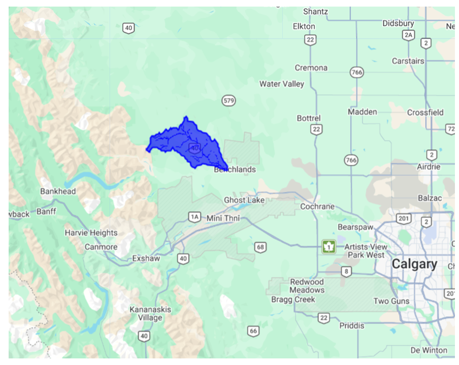
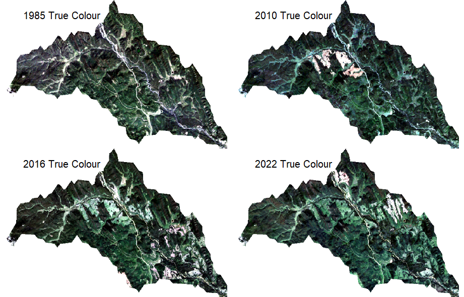
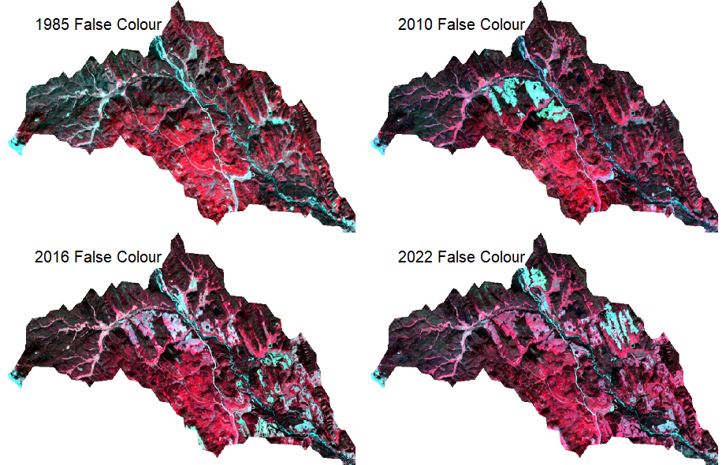
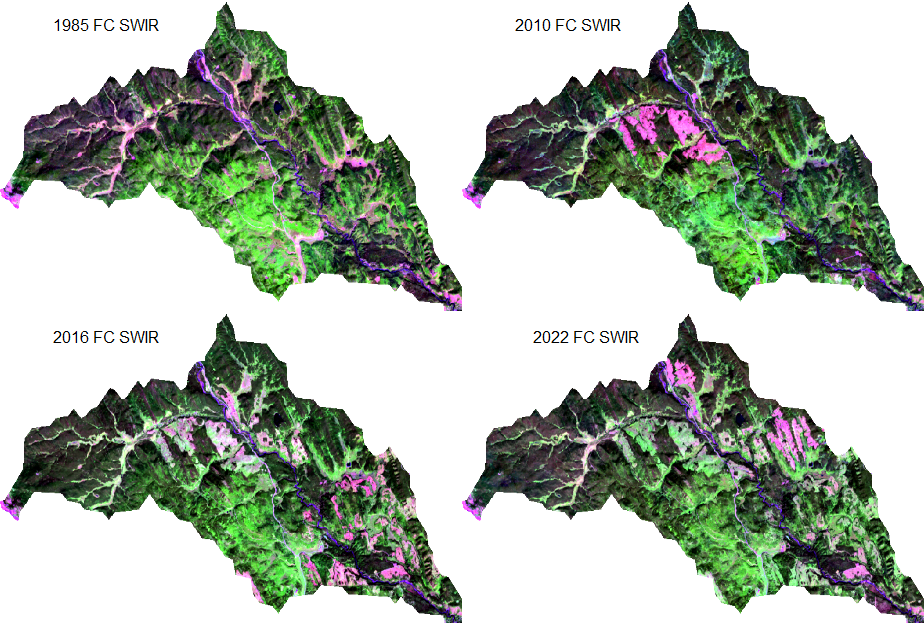
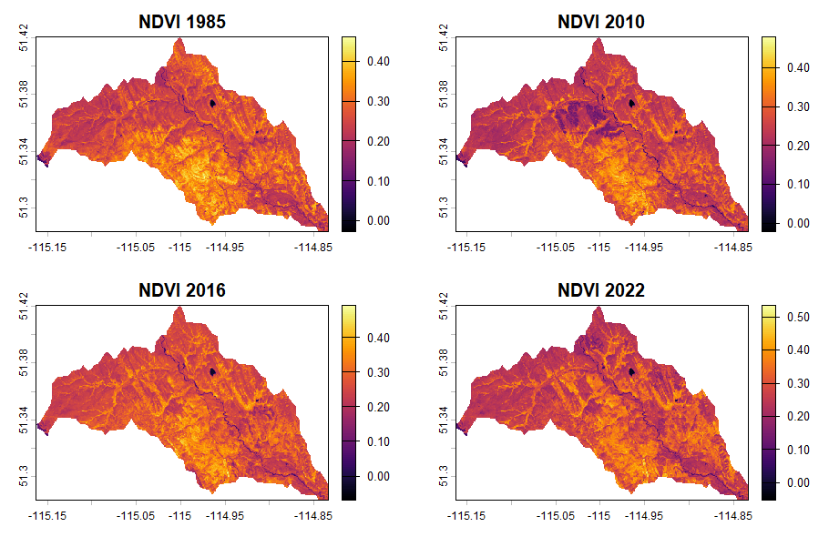
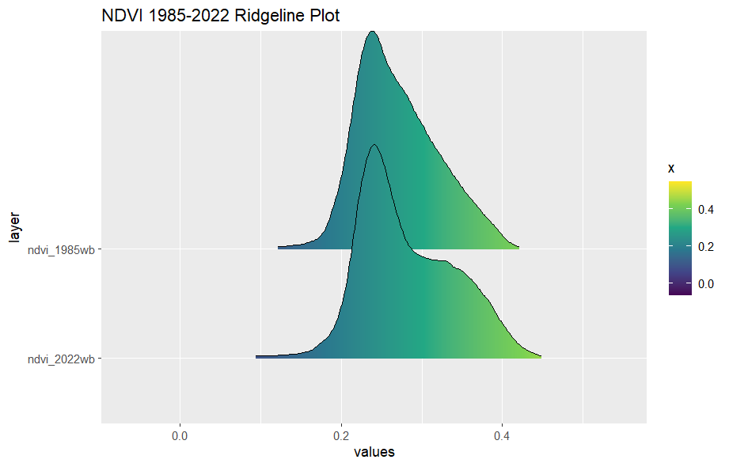

# WAIPAROUS BASIN (ALBERTA,CA) VEGETATION CHANGE LAND USE ANALYSIS (1985-2022) 🌲🐟   
### Spatial Ecology in R (B2111) (2025/2026)
#### Kathryn Hull, Matriculation number: 0001178795


# 1. Introduction 

The Waiparous Creek watershed, in the headwaters of the greater Bow River Basin, Alberta, Canada, is ecologically significant as it contains among the last remaining critical habitat for an endangered native trout species, Westslope Cutthroat Trout (_Oncorhynchus clarkii lewisi_) (Fisheries and Oceans Canada 2014). Among the threats to this species are logging impacts that contribute sediment into suitable trout streams, negatively impacting their survival, reproduction and habitat suitability. Westslope Cutthroat Trout require cool, well oxygenated water, clean (unconsolidated) gravel substrate, and abundant riparian edge cover and shade. Cumulative logging impacts have accelerated in the Waiparous Creek basin from 2010-2022.  This project aims to visualize, quantify and analyze these impacts by way of vegetation change satellite imagery analysis and land cover classification compared to benchmark reference conditions in 1985. This analysis is validated against human footprint mapping done by the Alberta Biodiversity Monitoring Institute ([ABMI Human Footprint Inventory](https://abmi.ca/abmi-home/what-we-do/land-cover-and-land-use-mapping/human-footprint-mapping.html)). Lastly, a cursory erosion risk assessment is included for cutblocks using terrain analysis tools. 



# 2. Project Objectives 

The primary objectives of this project include:
-i) Satellite imagery visualization: True Colour, False Colour and Shortwavelength-Infrared False Colour 
-ii) NDVI (Normalized Difference Vegetation Index) analysis
-iii) Time series, RGB Ridgeline Plot analysis 
-iv) Image classification time series analysis
-v) Land cover change analysis 
-vi) ABMI Human Footprint and Hydrology overlay analysis
-vii) Terrain mapping, cutblock slope erosion risk analysis

# 3. Methodology  

## Satellite Imagery Acquisition 
Preliminary visualization of the Waiparous Basin Study area was done using the GoogleEarth Pro application and QGIS, including use of historic imagery visualization tools. This refined the selection of 1985 (baseline), 2010 (start of logging impacts, 2016 (logging maximal concurrent extent), and 2022 (final year of logging) for comparative analysis. 

Satellite imagery used in this project was obtained from [Google Earth Engine, GEE] (https://earthengine.google.com/). 
> [!NOTE]
> JavaScript code utilized in GEE is given in the file Code.js.
> [!NOTE]
> For 1985 and 2010, the GEE Landsat 5 Thematic Mapper (TM) Collection 2, Level-2 dataset was used (ee.ImageCollection, LANDSAT/LT05/C02/T1_L2)
> For 2016 and 2022, Landsat 8 Operational Land Imager (OLI) / Thermal Infrared Sensor (TIRS) Collection 2, Level-2 dataset was used (ee.ImageCollection, LANDSAT/LC08/C02/T1_L2)
> The Landsat Missions are part of the U.S. Geological Survey (USGS) National Land Imaging (NLI) Program (https://www.usgs.gov/landsat-missions/landsat-satellite-missions). 
> Reference data source: https://www.usgs.gov/landsat-missions 
> 
## Waiparous Creek Watershed Study Area Delineation
The Waiparous Basin study area (area of interest - aoi) was clipped from the HydroBASINS Level 12 dataset (source: https://www.hydrosheds.org/products/hydrobasins). 

## Setting the Working Directory
All imagery generated in GEE was saved to a desktop folder Working Directory, using the setwd () function in R. 
````md
setwd("C:/Users/kalih/Desktop/Recology/RExam_Images")
````
## R Packages Installed
````r
library(imageRy) #Raster Imagery Operations, Vegetation Indices, Image Classification 
library(terra) #Spatial data analysis with vector and raster data (e.g. satellite imagery, DEM)
library(viridis) #Data visualization, colour maps and built-in palettes, colourblind friendly
library(RStoolbox) #Remote sensing image processing and analysis 
library(ggplot2) #Data visualization, custom aesthetics and geometries of charts 
library(patchwork) #Combines separate ggplot2 plots into a single composite layout
````
> [!NOTE]
> Complete R coding for all of the below is given in the file Code.R

# 4. Image Visualization

Prior to image visualization, GeoTiff raster files for each year generated in GEE were loaded in r. 
Example:
````r
wb_1985 <- rast("WaiparousBasin_1985MASKEDFINAL.tif") # Loads the 1985 Waiparous Basin aoi GeoTIFF raster file generated in GEE
````
Multi plot comparisons for 1985, 2010, 2016 and 2022 were generated for each of the visualizations below. 
Example R coding to set up a 2 by 2 plot window: 
````r
par(mfrow = c(2, 2))
mar = c(12, 4, 12, 4) # margins (bottom, left, top, right)
````

## True Colour Multi Plot

   

A True Colour RGB composite stacks red, green and blue bands into a single image for visualization of imagery that gives an intuitive, realistic representation that matches human vision. (Red, green and blue light represent that portion of the electromagnetic spectrum visible to the human eye)- 

Landsat 5 TM Bands (1985 and 2010 imagery), Red = Band 3, Green = Band 2, and Blue = Band 1
> Landsat 5 True Colour image R code example: 
````r
plotRGB(wb_1985, r = 3, g = 2, b = 1, stretch = "lin") # Creates a True Colour RGB plot in R using the red, green and blue bands. Stretch="lin" means “linear stretch” to improve visual contrast and brightness of an image.    
````
Landsat 8 Bands  (2016 and 2022 imagery), Red = Band 4, Green = Band 3, Blue = Band 2
> Landsat 8 True Colour image R code example: 
````r
plotRGB(wb_2016, r = 4, g = 3, b = 2, stretch = "lin")
````
Reference: https://www.usgs.gov/faqs/what-are-band-designations-landsat-satellites#main-content 

## False Colour Multi Plot



False Colour visualization uses Near-Infrared (NIR)-Red-Green (i.e. NRG) wavelength light bands (channels). NIR is mapped to the red channel, red is mapped to the green channel and green is mapped to the blue channel. False Colour (NRG) is useful for monitoring vegetation cover and changes in vegetation composition.  Chlorophyll in plants reflect NIR intensely, thus photosynthesizing vegetation shows as red. Deciduous vegetation appear as bright red while coniferous trees, reflect less NIR and appear darker. Grassland/shrubland open meadows appear as pink or light red. Areas of bare ground or rock appear cyan or blue as they have low NIR reflection and reflect moderately across all displayed bands. Clear and clean water bodies appear black as all radiation in the spectral range is absorbed. 

Landsat 5 TM Bands (1985 and 2010 imagery), NIR = Band 4, Red = Band 3, Green = Band 2
> Landsat 5 False Colour NRG image R code example: 
````r
plotRGB(wb_1985, r = 4, g = 3, b = 2, stretch = "lin") # Creates a False Colour NRG plot in R where red channel = NIR, green channel = Red, Blue channel = Green
````
Landsat 8 Bands  (2016 and 2022 imagery), NIR = Band 5, Red = Band 4, Green = Band 3
> Landsat 8 False Colour image R code example: 
````r
plotRGB(wb_2022, r = 5, g = 4, b = 3, stretch = "lin") # Creates a False Colour NRG plot in R where red channel = NIR, green channel = Red, Blue channel = Green
````
## False Colour SWIR Multi Plot



False Colour Shortwavelength Infrared (SWIR) plots are generated using SWIR1 mapped to the red channel, NIR mapped to the green channel and Green mapped to the blue channel. This composite is useful for discriminating between vegetated and non-vegetated surfaces, where moist exposed soil appears darker than dry areas. Healthy plants reflect NIR strongly and absorb SWIR. Dense coniferous vegetation appears dark green; Grassland/shrubland open meadows appear light or lime green. Logged cutblocks appear in shades of pink since bare soil, rocks and wood reflect high levels of SWIR (boosting the red channel) and moderate visible green light (boosting the blue channel). A combination of high red (SWIR) and moderate blue (green visible band) with lower green (NIR) creates the light pink to magenta colour. Watercourses appear purple since water strongly absorbs both SWIR and NIR wavelengths (i.e., red and green are very low) and reflects some visible green light (seen as blue). Shallow gravel riverbeds as in the Waiparous basin or water with suspended sediment adds a signal back into the SWIR/red or green channels, mixing with the blue to create a purplish tone (not pure black).

Landsat 5 TM Bands (1985 and 2010 imagery), SWIR1 = Band 5, NIR = Band 4, Red = Band 3, Green = Band 2
> Landsat 5 False Colour NRG image R code example: 
````r
plotRGB(wb_1985, r = 5, g = 4, b = 2, stretch = "lin")# Creates a False Colour SWIR plot in R where red channel = SWIR1, green channel = NIR, Blue channel = Green
````
Landsat 8 Bands  (2016 and 2022 imagery), SWIR1 = Band 6, NIR = Band 5, Red = Band 4, Green = Band 3
> Landsat 8 False Colour image R code example: 
````r
plotRGB(wb_2022, r = 6, g =5, b =3, stretch = "lin") # Creates a False Colour SWIR plot in R where red channel = SWIR1, green channel = NIR, Blue channel = Green
````
# 5. NDVI Analysis

A Difference Vegetation Index (DVI) is calculated as follows:
$` DVI = NIR - Red `$   
Since healthy plants strongly reflect NIR and absorb red light, a DVI quantifies vegetation presence and density. Higher DVI values indicate healthier or denser vegetation; lower values indicate sparse or stressed vegetation. 

A Normalized Difference Vegetation Index (NDVI) enables comparison of vegetation health and density across dates, sensors and variable light conditions by standardizing vegetation greenness into a -1 to +1 scale. 

NDVI is calculated using this formula: 
NDVI = (NIR − Red) / (NIR + Red)  
NDVI values approximating 1 represent dense, healthy vegetation); NDVI values approximating 0 represent bare soil and stressed vegetation. 

Example NDVI R calculation for Landsat 5 (1985 / 2010) Imagery:
````r
ndvi_1985wb <- (wb_1985[["SR_B4"]] - wb_1985 [["SR_B3"]]) / (wb_1985 [["SR_B4"]] + wb_1985 [["SR_B3"]]) #For Landsat 5, B4=NIR, B3=Red
````

Example NDVI R calcuation for Landsat 8 (2016 / 2022) Imagery:
````r
ndvi_2022wb <- (wb_2022[["SR_B5"]] - wb_2022 [["SR_B4"]]) / (wb_2022 [["SR_B5"]] + wb_2022 [["SR_B4"]])  #For Landsat 8, B5=NIR, B4=Red
````
Resulting NDVI Multi Plot, using the "inferno" colour palette from the viridis R package (https://cran.r-project.org/web/packages/viridis/vignettes/intro-to-viridis.html). 



This is a colour-blind safe palette that shows clear contrasts for low values from dark/black-purple for bare soil or water to high values from orange or bright yellow for dense broadleaf or grassland vegetation. Note that conifer forests dispaly as deep purples and dark reds (low NDVI values) due to branch shadows.  Needle-shaped leaves create internal canopy gaps and shadowing which reduces the total surface area available to scatter NIR light. 

## 1985 vs 2022 Stacked NDVI Ridgeline Plot
A stacked NDVI ridgeline plot was generated for the benchmark year (1985) compared to 2022 (post logging). By stacking the plots vertically, NDVI differences can be visualized clearly.  

R coding:
````r
ndvi_stack <- c(ndvi_1985wb, ndvi_2022wb)
names(ndvi_stack) <- c("ndvi_1985wb", " ndvi_2022wb")
im.ridgeline(ndvi_stack, scale=2)+ 
  labs(title = "NDVI 1985-2022 Ridgeline Plot") # 'scale=2' Controls height and visual spacing of the curves to facilitate interpretation of data.
````


Interpretation: NDVI curves differ slightly with the 2022 plot having a more gradually sloping right tail due to logging activities increasing open meadow and young (regenerating) forest composition on the landscape. Broader curves indicate a higher diversity in land cover types whereas narrow curves indicate more vegetation uniformity.  

