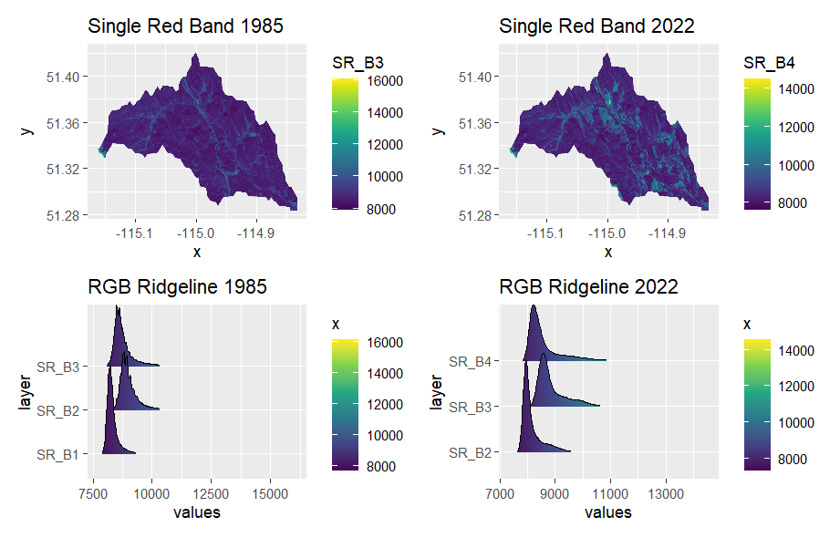
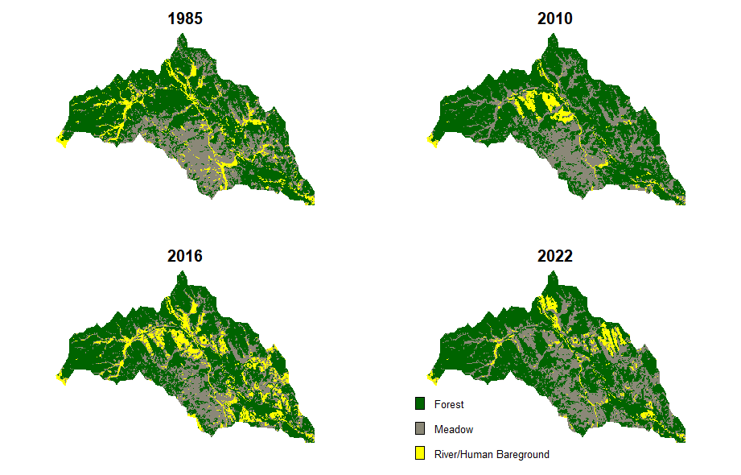
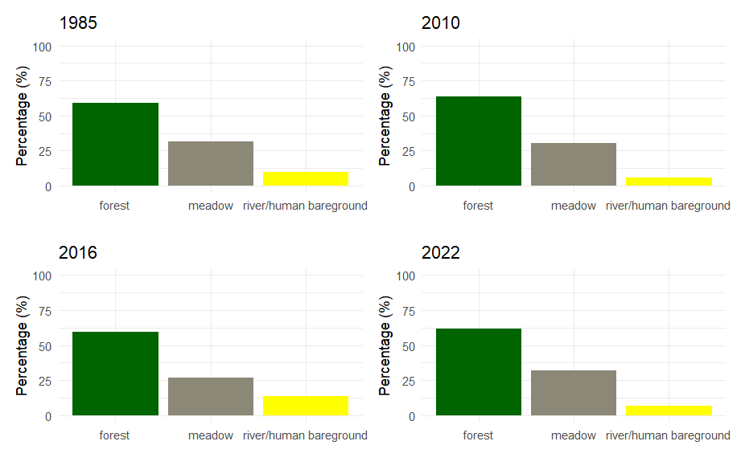
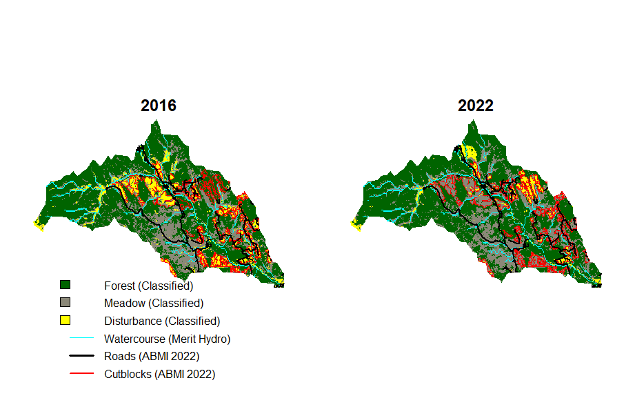
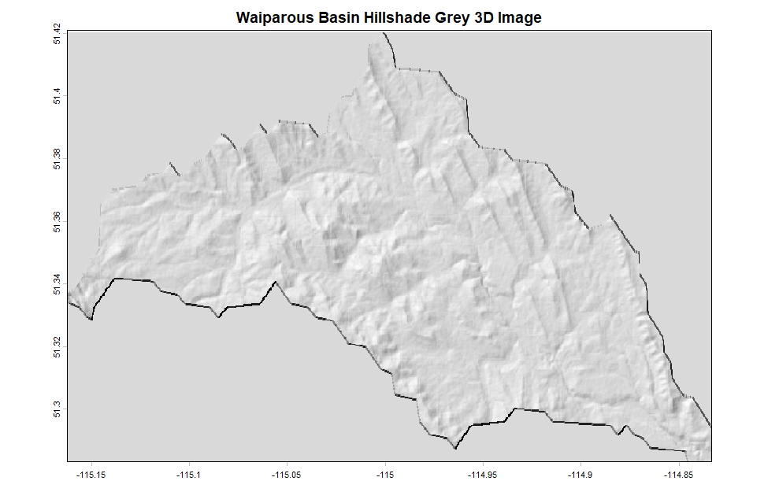
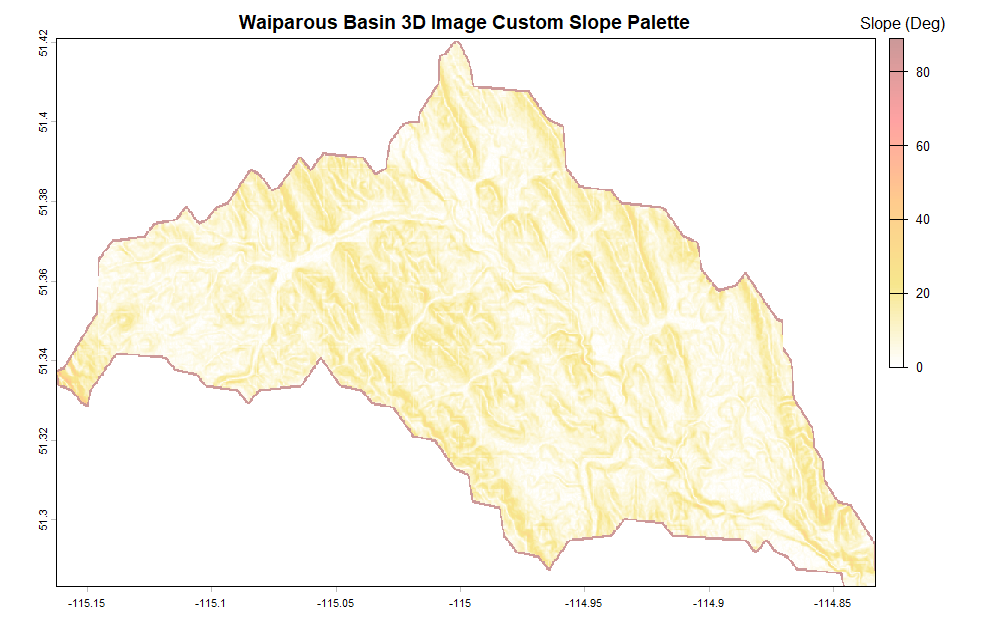
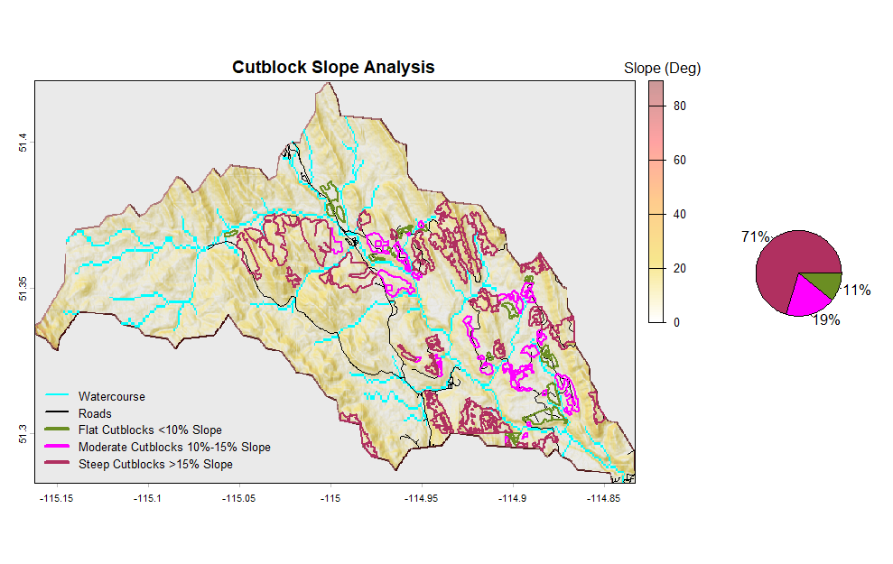
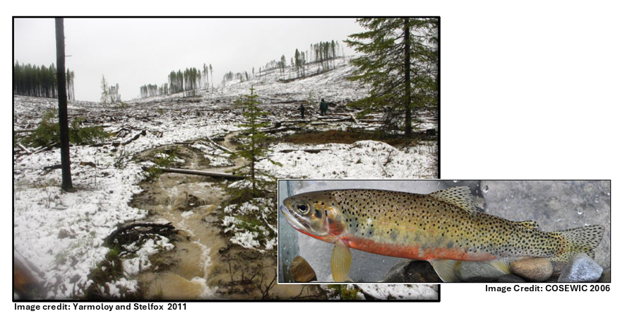

# WAIPAROUS BASIN (ALBERTA,CA) VEGETATION CHANGE LAND USE ANALYSIS (1985-2022) 🌲🐟   
### Spatial Ecology in R (B2111) (2025/2026)
#### Kathryn Hull, Matriculation number: 0001178795


# 1. Introduction 

The Waiparous Creek watershed, in the headwaters of the greater Bow River Basin, Alberta, Canada, contains among the last remaining critical habitat for Westslope Cutthroat Trout (_Oncorhynchus clarkii lewisi_), an endangered native species (COSEWIC 2006, Fisheries and Oceans Canada 2019). Among the threats to this species are logging impacts that contribute sediment into suitable trout streams, negatively impacting their survival, reproduction and habitat suitability (Valdal and Quinn 2011, Fisheries and Oceans Canada 2019). Westslope Cutthroat Trout require cool, well oxygenated water, clean unconsolidated gravel substrate, and abundant riparian edge cover and shade (COSWEIC 2006). Cumulative logging impacts have accelerated in the Waiparous Creek basin from 2010-2022. This project aims to visualize, quantify and analyze these impacts by way of vegetation change satellite imagery analysis and land cover classification compared to benchmark reference conditions in 1985. This analysis is validated against human footprint mapping done by the Alberta Biodiversity Monitoring Institute ([ABMI Human Footprint Inventory](https://abmi.ca/abmi-home/what-we-do/land-cover-and-land-use-mapping/human-footprint-mapping.html)). Lastly, a cursory erosion risk assessment is included for cutblocks using terrain analysis tools. 

#### Waiparous Creek Basin Study Area (Area of Interest- AOI) (blue polygon)

  

# 2. Project Objectives 

The primary objectives of this project include:

1. Satellite imagery visualization: True Colour, False Colour and Shortwavelength-Infrared False Colour 
2. NDVI (Normalized Difference Vegetation Index) analysis
3. Time series, RGB Ridgeline Plot analysis 
4. Land cover image classification time series 
5. Land cover change assessment
6. ABMI Human Footprint and hydrology overlay 
7. Terrain mapping and preliminary cutblock slope erosion risk assessment. 

# 3. Methodology  

## Waiparous Creek Watershed Study Area Delineation
The Waiparous Basin study area (area of interest - aoi) was clipped from the HydroBASINS Level 12 dataset (source: https://www.hydrosheds.org/products/hydrobasins). To confirm selection of the correct subbasin this dataset was first imported into QGIS as a vector shapefile.  

## Satellite Imagery Acquisition and Processing
Preliminary visualization of the Waiparous Basin Study area was done using the GoogleEarth Pro application and QGIS, including use of historic imagery visualization tools. This refined the selection of 1985 (baseline year, first year with Landsat 5 imagery), 2010 (start of logging impacts), 2016 (maximum logging footprint), and 2022 (final year of logging) for comparative analysis. 

Satellite imagery used in this project was obtained from [Google Earth Engine, GEE](https://earthengine.google.com/). 

For each study year, imagery from June 1 to August 31 (peak summer growing season) was pre-processed in GEE JavaScript code to create a single, clean, cloud-free image clipped to the study area. This processing technique calculates the median pixel value across all available dates for each image to produce a final clean composite image. Coding to achieve cloud and shadow masking was informed by this [SERVIR-Amazonia tutorial](https://servir-amazonia.github.io/barbados-training/intro-gee2/processing-cloudmasking-landsat.html).  ([SERVIR-Amazonia](https://alliancebioversityciat.org/projects/servir-amazonia) is informed by NASA and USAID to inform environmental management in the Amazon basin through integration of satellite data and geospatial technologies).  

> [!NOTE]
> JavaScript code utilized in GEE is given in the file [Code.js](https://github.com/kathrynlhull/Spatial_Ecology_in_R_2025/blob/main/RExam_Sept7_26/Code.js)
> 
> - For **1985 and 2010**, the GEE **Landsat 5** Thematic Mapper (TM) Collection 2, Level-2 dataset was used (ee.ImageCollection, LANDSAT/LT05/C02/T1_L2)
>-  For **2016 and 2022**, **Landsat 8** Operational Land Imager (OLI) / Thermal Infrared Sensor (TIRS) Collection 2, Level-2 dataset was used (ee.ImageCollection, LANDSAT/LC08/C02/T1_L2)
>-  The Landsat Missions are part of the U.S. Geological Survey (USGS) National Land Imaging (NLI) Program (https://www.usgs.gov/landsat-missions/landsat-satellite-missions).

## Setting the Working Directory
All imagery generated in GEE was saved to a desktop folder Working Directory, using the setwd () function in R. 
````md
setwd("C:/Users/kalih/Desktop/Recology/RExam_Images")
````
## R Packages Installed
````r
library(imageRy) #Raster Imagery Operations, Vegetation Indices, Image Classification 
library(terra) #Spatial data analysis with vector and raster data (e.g. satellite imagery, DEM, terrain analysis, hillshade maps)
library(viridis) #Data visualization, colour maps and built-in palettes, colourblind friendly
library(RStoolbox) #Remote sensing image processing and analysis 
library(ggplot2) #Data visualization, custom aesthetics and geometries of charts 
library(patchwork) #Combines separate ggplot2 plots into a single composite layout
````
> [!NOTE]
> Complete R coding for all of the below is given in the file [Code.R](https://github.com/kathrynlhull/Spatial_Ecology_in_R_2025/blob/main/RExam_Sept7_26/Code.R).

# 4. Image Visualization

Prior to image visualization, GeoTiff raster files for each year generated in GEE were loaded in r. 
Example:
````r
wb_1985 <- rast("WaiparousBasin_1985MASKEDFINAL.tif") # Loads the 1985 Waiparous Basin aoi GeoTIFF raster file generated in GEE
````
Multi plot comparisons for 1985, 2010, 2016 and 2022 were generated for each of the visualizations below. 

Example R coding to set up a 2 by 2 plot window: 
````r
par(mfrow = c(2, 2))
mar = c(12, 4, 12, 4) # margins (bottom, left, top, right)
````

**Satellite imagery visualization methods: A) True Colour, B) False Colour and C) Shortwavelength-Infrared False Colour**
<br/>
<br/>
Landsat imagery band designations reference: https://www.usgs.gov/faqs/what-are-band-designations-landsat-satellites#main-content
<br/>

### A - True Colour Multi Plot

   

> **Interpretation**
> A True Colour RGB composite stacks red, green and blue bands into a single image for visualization of imagery that gives an intuitive, realistic representation that matches human vision. Red, green and blue light represent that portion of the electromagnetic spectrum visible to the human eye. Disturbed areas appear in shades of white; vegetated areas appear in lighter shades of green for broadleaf herbaceous vegetation (meadows/shrublands/deciduous forest) to very dark green (conifer forests). 

**True Colour, RGB Landsat 5 TM Bands (1985 and 2010 imagery), Red = Band 3, Green = Band 2, and Blue = Band 1**
> Landsat 5 True Colour R code example: 
````r
plotRGB(wb_1985, r = 3, g = 2, b = 1, stretch = "lin") # Creates a True Colour RGB plot in R using the red, green and blue bands. Stretch="lin" means “linear stretch” to improve visual contrast and brightness of an image.    
````
**True Colour, RGB Landsat 8 Bands  (2016 and 2022 imagery), Red = Band 4, Green = Band 3, Blue = Band 2**
> Landsat 8 True Colour R code example: 
````r
plotRGB(wb_2016, r = 4, g = 3, b = 2, stretch = "lin")
````
<br/>

### B - False Colour Multi Plot


> **Interpretation**
> False Colour visualization uses Near-Infrared (NIR)-Red-Green (NRG) wavelength light bands (channels). NIR is mapped to the red channel, red is mapped to the green channel and green is mapped to the blue channel. False Colour (NRG) is useful for monitoring vegetation cover and changes in vegetation composition and health. Chlorophyll in plants reflect NIR intensely, thus healthy, photosynthesizing vegetation shows as red. Deciduous (broadleaf) vegetation appear as bright red while coniferous trees, reflect less NIR and appear darker. Grassland/shrubland open meadows appear as pink or light red. Areas of bare ground or rock appear cyan or blue as they have low NIR reflection and reflect moderately across all displayed bands. Clear and clean water bodies appear black as all radiation in the spectral range is absorbed. 

**False Colour Landsat 5 TM Bands (1985 and 2010 imagery) NIR = Band 4, Red = Band 3, Green = Band 2**
> Landsat 5 False Colour NRG R code example: 
````r
plotRGB(wb_1985, r = 4, g = 3, b = 2, stretch = "lin") # Creates a False Colour NRG plot in R where red channel = NIR, green channel = Red, Blue channel = Green
````
**False Colour Landsat 8 Bands  (2016 and 2022 imagery), NIR = Band 5, Red = Band 4, Green = Band 3**
> Landsat 8 False Colour NRG R code example: 
````r
plotRGB(wb_2022, r = 5, g = 4, b = 3, stretch = "lin") # Creates a False Colour NRG plot in R where red channel = NIR, green channel = Red, Blue channel = Green
````
<br/>


### C - False Colour SWIR Multi Plot


> **Interpretation**
> False Colour Shortwavelength Infrared (SWIR) plots are generated using SWIR1 mapped to the red channel, NIR mapped to the green channel and Green mapped to the blue channel. This composite is useful for discriminating between vegetated and non-vegetated surfaces, where moist exposed soil appears darker than dry areas. Healthy plants reflect NIR strongly and absorb SWIR. Dense coniferous vegetation appears dark green; Grassland/shrubland open meadows and deciduous forests appear light or lime green. Logged cutblocks appear in shades of pink since bare soil, rocks and wood reflect high levels of SWIR (boosting the red channel) and moderate visible green light (boosting the blue channel). A combination of high red (SWIR) and moderate blue (green visible band) with lower green (NIR) creates the light pink to magenta colour. Watercourses appear purple since water strongly absorbs both SWIR and NIR wavelengths (i.e., red and green are very low) and reflects some visible green light (seen as blue). Shallow gravel riverbeds as in the Waiparous basin or water with suspended sediment adds a signal back into the SWIR/red or green channels, mixing with the blue to create a purplish tone (not pure black).

**False Colour SWIR Landsat 5 TM Bands (1985 and 2010 imagery), SWIR1 = Band 5, NIR = Band 4, Red = Band 3, Green = Band 2**
> Landsat 5 False Colour SWIR R code example: 
````r
plotRGB(wb_1985, r = 5, g = 4, b = 2, stretch = "lin")# Creates a False Colour SWIR plot in R where red channel = SWIR1, green channel = NIR, Blue channel = Green
````
**False Colour SWIR Landsat 8 Bands  (2016 and 2022 imagery), SWIR1 = Band 6, NIR = Band 5, Red = Band 4, Green = Band 3**
> Landsat 8 False Colour SWIR image R code example: 
````r
plotRGB(wb_2022, r = 6, g =5, b =3, stretch = "lin") # Creates a False Colour SWIR plot in R where red channel = SWIR1, green channel = NIR, Blue channel = Green
````
<br/>
<br/>

# 5. NDVI Analysis

A **Difference Vegetation Index (DVI)** is calculated as follows: <ins> ***DVI = NIR - Red*** </ins>.  

Since healthy plants strongly reflect NIR and absorb red light, a DVI quantifies vegetation presence and density. Higher DVI values indicate healthier or denser vegetation; lower values indicate sparse or stressed vegetation. 

A **Normalized Difference Vegetation Index (NDVI)** enables comparison of vegetation health and density across dates, sensors and variable light conditions by <ins>standardizing vegetation greenness into a -1 to +1 scale</ins>. NDVI is strongly correlated with plant biomass and leaf area index (Atkins *et al.* 2018).

NDVI is calculated using this formula: <ins> ***NDVI = (NIR − Red) / (NIR + Red)***  </ins>.  

**NDVI values approximating 1 represent dense, healthy vegetation. NDVI values approximating 0 represent bare soil and stressed vegetation**

Reference: https://www.usgs.gov/landsat-missions/landsat-normalized-difference-vegetation-index. 

<br/>
<br/>

<ins> **Example NDVI R calculation for Landsat 5 (1985 / 2010) Imagery:** </ins> 
````r
ndvi_1985wb <- (wb_1985[["SR_B4"]] - wb_1985 [["SR_B3"]]) / (wb_1985 [["SR_B4"]] + wb_1985 [["SR_B3"]]) #For Landsat 5, B4=NIR, B3=Red
````

<ins> **Example NDVI R calcuation for Landsat 8 (2016 / 2022) Imagery:**  </ins> 
````r
ndvi_2022wb <- (wb_2022[["SR_B5"]] - wb_2022 [["SR_B4"]]) / (wb_2022 [["SR_B5"]] + wb_2022 [["SR_B4"]])  #For Landsat 8, B5=NIR, B4=Red
````

<br/>
<br/>
Resulting NDVI Multi Plot, using the "inferno" colour palette from the viridis R package (https://cran.r-project.org/web/packages/viridis/vignettes/intro-to-viridis.html): 

### NDVI Time Series Composite for the Waiparous Basin Study Area


> **Interpretation**
> This is a colour-blind safe palette that shows clear contrasts for low values from dark/black-purple for bare soil or water to high values from orange or bright yellow for dense broadleaf or herbaceous (graminoid) vegetation. Note that conifer forests display as deep purples and dark reds (low NDVI values) due to branch shadows.  Needle-shaped leaves create internal canopy gaps and shadowing which reduces the total surface area available to scatter NIR light (Walker and Kenkel 2000, Rautiainen and Stenberg 2005). Logging impacts are not clearly discernible since the NDVI time series has year-to-year variation in natural vegetation productivity and vigour. Landscape complexity (natural meadows, natural flood disturbance) and variable maturity of regenerating cutblocks also blur cutblock boundaries. 

## 1985 vs 2022 Stacked NDVI Ridgeline Plot
A stacked NDVI ridgeline plot was generated for the benchmark year (1985) compared to 2022 (post logging). By stacking the plots vertically, NDVI differences can be visualized clearly.  

R coding:
````r
ndvi_stack <- c(ndvi_1985wb, ndvi_2022wb)
names(ndvi_stack) <- c("ndvi_1985wb", " ndvi_2022wb")
im.ridgeline(ndvi_stack, scale=2)+ 
  labs(title = "NDVI 1985-2022 Ridgeline Plot") # 'scale=2' Controls height and visual spacing of the curves to facilitate interpretation of data.
````

### NDVI Stacked Ridgeline Plot for the Waiparous Basin Study Area


> **Interpretation**
> NDVI curves differ slightly with the 2022 plot having a more gradually sloping right tail possibly due to logging activities increasing open meadow and young (regenerating) forest composition on the landscape. Broader curves indicate a higher diversity in land cover types whereas narrow curves indicate more vegetation uniformity. Compared to 1985 there seems to be a dip in NDVI values from 0.25 to 0.35 possibly influenced by forestry activities. Since source images include cloud-free composites from June to August, variable vegetation growth phase (phenology) and climate complicate interpretation of NDVI time series comparisons (Notaro *et al.* 2019). Natural areas of bare ground such as broad gravel and alluvial floodplains and rocky surfaces in addition to anthropogenic ground disturbance (e.g. off-highway vehicle use) further confound interpretation of results.    

# 6. RGB Imagery and Ridgeline Plot Time Series Analysis 
A secondary time series analysis for the 1985 (benchmark) and 2022 (post logging) images was done using RGB imagery (using only the red band to show vegetation cover change) and ridgeline plots where the Red-Green-Blue bands are extracted and combined into a 3-band raster image. 

This analysis uses the imageRy package im.ggplot() and im.ridgeline() functions (https://cran.r-project.org/web/packages/imageRy/refman/imageRy.html). 

R coding:
````r
p1985 <- rast("WaiparousBasin_1985MASKEDFINAL.tif") 
p1985 <- c(p1985[[3]], p1985[[2]], p1985[[1]]) # Landsat 5 Bands: Red=3, Green=2, Blue=1; Extract RGB bands and combine into 3-band raster image
p2022<- rast("WaiparousBasin_2016_RawBandsL8.tif")
p2022 <- c(p2022[[4]], p2022[[3]], p2022[[2]]) # Landsat 8 Bands: Red=4, Green=3, Blue=2; Extract RGB bands and combine into 3-band raster image
plot1 <- im.ggplot(p1985[[1]]) + labs(title = "Single Red Band 1985") # Single band visual using red band to show vegetation cover change
plot2 <- im.ggplot(p2022[[1]]) + labs(title = "Single Red Band 2022")  # Single band visual using red band to show vegetation cover change
plot3 <- im.ridgeline(p1985, scale=2) + labs(title = "RGB Ridgeline 1985") # Ridgeline plots show the distribution of pixel values across the RGB bands.
plot4 <- im.ridgeline(p2022, scale=2) + labs(title = "RGB Ridgeline 2022") # Ridgeline plots show the distribution of pixel values across the RGB bands.
plot1 + plot2 + plot3 + plot4
````

### RGB Ridgeline Time Series for the Waiparous Basin Study Area

> **Interpretation**
> The ridgeline plots are similar, except that 2022 RGB bands all have broader curves with longer right tails and less defined peaks indicating less vegetation uniformity. Logging disturbance in the basin likely contributed to less RGB light absorption and increasing RGB light reflection due to reduced healthy vegetation cover and increased bare ground cover. Red (B3, 1985; B4, 2022) and then blue light (B1 1985; B2 2022) is most strongly absorbed by chlorophyll in plants; green is more weakly absorbed. However, ridegeline plots are quite similar overall.  The natural landscape complexity including open grassy meadows and broad gravel floodplains along waterways in the Waiparous basin obscures and dilutes the effects of logging in the plots. 

# 7. Image Classification Using False Colour Bands

The im.classify() function from the imageRy R package was used to conduct unsupervised image classification specifying 3 classes of land cover type (based on prior False Colour image visualization above). Prior to classification raster image subsets were created for each study year that select only the NIR, Red and Green Bands (i.e., False colour scheme for optimized land cover type differentiation). 

Example R coding:
````r
wb_1985_subset <- wb_1985[[c(4, 3, 2)]] # Creates a raster image subset for 1985 selecting Landsat 5 bands, NIR=B4, Red=B3, Green=B2
wb_1985c <- im.classify(wb_1985_subset, num_clusters=3) # Used to classify image into 3 land cover classes
````
Class clustering is randomly assigned each time this code is run. To allow for time series land cover classification comparison, classes were manually assigned as follows: Forest=1 (represents coniferous forest); Meadow=2 (represents natural open meadows and regenerating cutblocks); River/Human Bareground =3 (includes new cutblocks, roadways, and gravel riverbeds). 

Example R coding to set class numbering assignment, with numbers in [] varying based on random im.classify() function above:
````r
wb_1985cset <- wb_1985c
wb_1985cset[wb_1985c == 2] <- 1  # Set Forest to 1 
wb_1985cset[wb_1985c == 3] <- 2  # Set Meadow to 2
wb_1985cset[wb_1985c == 1] <- 3  # Set RIVER/HUMAN BAREGRND to 3
````  
A consistent colour palette was defined for image classification using this coding:
````r
my_colours <- c("darkgreen", "cornsilk4", "yellow") # c(Forest, Meadow, River/Human Bareground)
````
A two by two grid with an outer margin for the legend text was used to plot classified images from all years using the colour scheme legend above.
````r
par(mfrow = c(2, 2)) # Set up the plotting window  (2 rows, 2 columns)
mar = c(2, 4, 4, 4) # mar = c(bottom, left, top, right)
oma= c(12, 4, 4, 4) # oma = c(bottom, left, top, right), outer margin area
plot(wb_1985cset, col = my_colours, main = "1985", axes = FALSE, legend=FALSE) # 1985 classified image plot
plot(wb_2010cset, col = my_colours, main = "2010", axes = FALSE, legend=FALSE) # 2010 classified image plot
plot(wb_2016cset, col = my_colours, main = "2016", axes = FALSE, legend=FALSE) # 2016 classified image plot
plot(wb_2022cset, col = my_colours, main = "2022", axes = FALSE, legend=FALSE) # 2022 classified image plot
legend ("bottomright",
        inset = c(0.5, -0.2),
        legend = c("Forest", "Meadow", "River/Human Bareground"), 
        fill = my_colours,  #use custom predefined colour palette 
        horiz = FALSE,     # horizontal legend
        bty = "n",         # No border
        cex = 0.8,         # Makes text larger
        xpd = TRUE)        # ALLOWS DRAWING OUTSIDE ALL PLOTS
````
### Time Series Image Classification for the Waiparous Basin Study Area


# 8. Land Cover Change Analysis

To quantify land cover changes over time in the study area, a simple analysis was done to calculate the relative frequency of each land cover class (i.e., frequency/total). The ncell() (i.e., total number of cells (pixels)) in each raster image was adjusted to exclude blank NA cells. Since the aoi was clipped to the Waiparous Basin, it includes blank NA cells that are not displayed (i.e., those that fall outside of the basin polygon). 

Example R coding: 
````r
f1985 <- freq(wb_1985cset) # Determine the frequency of each of the three set cover types from the classification analysis above for the 1985 raster image
ncell1985_valid <- sum(f1985$count) # Determine the valid total number of cells in the aoi by summing only the column with the cell counts from the frequency table to exclude blank NA cells.
perc1985 = freq(wb_1985cset) * 100 / ncell1985_valid # Determine the cover class percentages for 1985
#Repeat above coding for 2010, 2016 and 2022
````
Cover class percentages from this analysis were then combined into a data frame and a summary comprehensive table:
````r
class <- c("forest", "meadow","river/human bareground")
perc1985<- c(59.2,31.4,9.5)
perc2010 <- c(63.9,30.6,5.4)
perc2016 <- c(59.4, 26.9,13.7)
perc2022<- c(61.6, 31.9,6.5)
twb_luc <- data.frame(class, perc1985, perc2010, perc2016, perc2022)
````

### Land Cover Class Change Table
 | Class | 1985 (%) | 2010 (%) | 2016 (%) | 2022 (%) |
|-------|:-------:|:-------:|:-------:|:-------:|
| 1                 Forest  |  59.2    |  63.9    | 59.4     |    61.6 |
| 2                 Meadow  |  31.4    | 30.6     | 26.9     |   31.9  |
| 3 River/Human Bareground  |   9.5    | 5.4      |  13.7    |   6.5   |
 
The ggplot2 R package was used to display this data in a comparative bar graph format using the predefined "my_colours" colour scheme. 
References: https://ggplot2.tidyverse.org/; https://r4ds.hadley.nz/data-visualize; https://r-charts.com/ranking/bar-plot-ggplot2/; https://ggplot2.tidyverse.org/reference/ggtheme.html.  

Example R coding:
````r
p1 <- ggplot(twb_luc, aes(x=class, y=perc1985, fill=class)) +  
  geom_bar(stat="identity") + 
  scale_fill_manual(values = my_colours) + 
  ylim(c(0,100)) +
  labs(title = "1985", y = "Percentage (%)", x = "") +
  theme_minimal() +
  theme(legend.position = "none")
# Above code (repeated for each year - p2 [2010], p3 [2016], p4 [2022])

#aes() aesthetics mapping function, where "class" categories are placed on the x axis; "per1985" numerical values from the twb_luc data frame column determine the vertical y axis values for bar heights; fill=class instructs the chart to give a unique fill colour to each category in the class column.
#geom_bar () function for rending a rectangular bar plot.
#(stat="identity") tells R to use the exact numeric value in the perc1985 column for the bar heights.
#scale_fill_manual(values = my_colours) forces the bars to use a custom "my_colours" colour palette
#ylim(c(0,100)) sets the limits for the Y axis from 0% to 100%
#theme_minimal() uses a minimalist theme for a clean, uncluttered chart.
#theme(legend.position = "none") removes the automatically generated colour legend

p1+p2+p3+p4 # develops a composite of the four plots
````
### Land Cover Class Analysis Visualization Using ggplots2 


# 9. Human Footprint Inventory and Hydrology Overlay Analysis
Published hydrology and Human Footprint Inventory data for the study area was imported into R for visualization overlays using classified images generated above. This data was clipped to the Waiparous Basin aoi to quantify road and cutblock surface areas and total disturbed footprint specific to this study area. The hydrology stream overlay allows for distinction of natural gravel waterbeds versus road or other human disturbance. 

A hydrology GeoTiff file was generated using JavaScript coding in GEE (see Code.js file).  Significant tributary streams were added using the [MERIT Hydro Global Hydrography Dataset](https://developers.google.com/earth-engine/datasets/catalog/MERIT_Hydro_v1_0_1). 

The following r code was used to import the Waiparous Basin MERIT stream raster TIF, resample it to match the Landsat 30 m grid, and to create an overlay plot onto the 2016 classified image. 
````r
wb_streams <- rast("WaiparousBasin_MERIT_Streams.tif") #import the Merit Stream GeoTiff from GEE
wbstreams_res <- resample(wb_streams , wb_2016cset, method="near") # This function from the Terra package transfers the values of the Streams.tif to match the geometry (cell size) of the 30 m Landsat "wb_2016cset" raster object.
#Resample() function coding reference: https://www.pmassicotte.com/posts/2022-04-28-changing-spatial-resolution-of-a-raster-with-terra/
wbstreams_final <- wbstreams_res 
wbstreams_final[wbstreams_final ==0] <- NA #Set all non-stream pixels (0) to NA (invisible) 
plot(wb_2016cset, col = my_colours, main = "2016", axes = FALSE, legend=FALSE) #Axes and legend set to FALSE to hide axis lines, ticks and coordinate labels and to exclude a plot legend
plot(wbstreams_final, col="cyan", lwd=1.5, add=TRUE, legend=FALSE) #Lwd is the line thickness; Add=true forces R to draw these streams directly on top of the plot above
```` 
Road and cutblock shapefiles for the study area were extracted and clipped to the aoi in QGIS from the Alberta Biological Monitoring Institute (ABMI) Human Footprint Inventory data portal (https://abmi.ca/data-portal/80.html). 
 
The following R code was used to import ABMI shapefiles into R and to calculate road surface, cutblock area, and total human footprint for the Waiparous Basin study area.

````r
roads <- vect("wb_roadsclipped.shp") #Import the ABMI roads vector shapefile clipped to the aoi in QGIS. vect() is the Terra package function for vector shapefiles.
roads <- project(roads, crs(wb_2016cset)) #Match the projection of the imported shapefile to that of the "wb_2016cset" raster using the crs() Terra function (Coordinate Reference System).
road_polygons <- buffer(roads, width = 5) #To calculate road surface area create a road polygon from the line file using a buffer width of 5 m since the average road width in the aoi is approximately 10 m. Uses the buffer() function from the Terra package.
road_footprint <- aggregate(road_polygons) #Aggregates all of the road polygons into a single polygon; aggregate() function is from the Terra package.
road_area_sqm <- expanse(road_footprint) #Compute the surface area in square meters for the road_footprint polygon using expanse() function from Terra package.
road_area_km2 <- road_area_sqm / 1e6 #Convert to square kilometers 
cutblocks_2022ABMI <- vect("wb_cutblockfix_clip.shp") #Import the ABMI cutblock (timber harvest block) vector shapefile clipped to the aoi in QGIS.  
cutblocks <- project(cutblocks_2022ABMI, crs(wb_2016cset)) #Match the Coordinate Reference System of the imported shapefile to that of the "wb_2016cset" raster
areas_km2_cutblocks<- expanse(cutblocks, unit = "km") #Compute the surface area in square km for each individual cutblock polygons
cutblock_footprint <- sum(areas_km2_cutblocks) #Sum the surface area for the cutblocks 
total_human_footprint_km2 <- cutblock_footprint + road_area_km2 #Calculate a total human footprint for the study area that sums cutblock and road footprint 
aoi_area_km2 <- 155.81651679640706 #Area in square km for the Waiparous Basin aoi generated in GEE
footprint_percentage <- (total_human_footprint_km2 / aoi_area_km2) * 100 #Calculate a total human footprint percentage for the aoi
cutblock_percentage <- (cutblock_footprint / aoi_area_km2) * 100 #Calculate a total cutblock footprint percentage for the aoi
roads_percentage <- (road_area_km2 / aoi_area_km2) * 100 #Calculate a total road footprint percentage for the aoi
footprint_df <- data.frame(road_area_km2,roads_percentage, cutblock_footprint,cutblock_percentage, total_human_footprint_km2,footprint_percentage) #Summarize in a table
````
## Human Footprint Summary for the Study Area
 | Road Area (sqKm) | Road Area (%) | Cutblock Area (sqKm) | Cutblock (%) | Total Human Footprint Area (sqKm) | Total Human Footprint Area (%)|
|:-------:|:-------:|:-------:|:-------:|:-------:|:-------:|
|0.81|0.52|20.0|12.8|20.8|13.3|

### Human Footprint Inventory and Hydrology Overlays (Using 2016 and 2022 Classified Images Base Maps)
> [!NOTE]
> See the file Code.R for coding used to generate the map composite below.


> **Interpretation**
> There is good conformity between mapped ABMI cutblocks and yellow areas of land disturbance (from image classification). In 2022, the ABMI shapefile missed a cutblock in the north extent of the study area, thus the human footprint summary above is an underestimation.

# 10. Terrain Mapping, Cutblock Slope Erosion Risk Analysis

A cursory analysis was done as described below to identify and determine erosion risk for cutblocks based on slope steepness using Digital Elevation Model (DEM) raster data for the study area imported from GEE.

This analysis entailed the following steps (see coding below):
- Load the DEM from GEE
- Calculate slope in degrees
- Generate a hillshade map using Terra package functions based on slope and aspect values from the DEM
- Plot the hillshade map using a custom colour palette to show slope gradient from white (flat) to red (steep) in shades of orange
- Define cutblock slope steepness categories where flat slopes are defined as >10%, moderate slopes are 10% to 15%, and steep slopes are >15% (ttps://sis.agr.gc.ca/cansis/nsdb/dss/v3/cmp/slope_p.html). 
- Calculate the area and percentage of each cutblock steepness category
- Generate a composite plot with slope (in degrees), stream and road lines, and colour coded slope steepness categories with percentages for each shown as a pie chart graphic.

## Hillshade Imagery and Coding


````r
#Hillshade coding below uses Terra package
#shade () function reference: https://search.r-project.org/CRAN/refmans/terra/html/shade.html
elevation <- rast("WaiparousBasin_Elevation.tif") #Load the DEM (elevation.tif) file generated in GEE
slope_r <- terrain(elevation, v="slope", unit="degrees") # Calculate Slope in degrees
sl <- terrain(elevation, v="slope", unit="radians") #Calculate slope in radian units for hillshade map
as <- terrain(elevation, v="aspect", unit="radians") #Calculate aspect in radian units for hillshade map
hs <- shade(sl, as, angle = 45, direction = 315)  #Create hillshade map where sl=input slope raster layer in radian units; as=input aspect in radian units, angle=45 sets the sun angle to maximize hillshade shadows; direction sets the sun azimuth direction as 315 NW to cast shadows to the SE
plot(hs, col=grey(0:100/100), legend=FALSE, main="Waiparous Basin Hillshade Grey 3D Image") #plots hillshade image using grey palette with 100 shades from black(0) to white (100)
````
## Custom Slope Palette 3D Imagery and Coding


````r
# colorRampPalette () function reference https://bookdown.org/rdpeng/exdata/plotting-and-color-in-r.html 
# White (flat) -> Yellow -> Orange -> Red -> Darkred (steep)
slope_palette <- colorRampPalette(c("white", "gold2", "darkorange", "firebrick1", "firebrick4"))(100)
# Drape the Slope Colour Palette over the hillshade image
# Reference https://cran.r-project.org/web/packages/terra/refman/terra.html#plot 
# Use 'slope_r' (the slope raster layer in degrees) for the legend to be readable
plot(slope_r, 
     col=slope_palette,  
     alpha = 0.45, #sets transparency to 45% to visualize 3D texture
     main ="Waiparous Basin 3D Image Custom Slope Palette",
     plg = list(title = "Slope (Deg)", shrink = 0.8)) #plg=list() list with parameters for drawing the legend. Adds the slope (deg) gradient legend on the right 
````
## Define,Calculate and Map Cutblock Slope Steepness Categories with Percentages

> **Interpretation**
> The majority of cutblocks have a strongly elevated (71%) or moderately elevated (19%) erosion risk due to having slopes of >15% or 10% respectively. This indicates a high potential for logging activity to have contributed to short term impacts contributing sediment into trout streams. 

````r

#Define slope steepness thresholds so as to identify flat (>10%), moderate (10-15%) and steep (>15%) slopes for erosion risk analysis
#Reference https://sis.agr.gc.ca/cansis/nsdb/dss/v3/cmp/slope_p.html)
#Convert slope % thresholds to degrees
#Formula: degrees = atan(percent / 100) * (180 / pi)
#atan() is the arctangent (or inverse tangent function) that takes the decimal ration (rise/run) and calculates the corresponding angle.
#(180 / pi) converts the angle from radians to degrees. 
# 10% slope = ~5.71 degrees
threshold_10pct <- atan(10 / 100) * (180 / pi)
# 15% slope = ~8.53 degrees
threshold_15pct <- atan(15 / 100) * (180 / pi)

# Ensure your Slope raster and Cutblock vector match in CRS (coordinate reference system) using Terra package project() function 
cutblocks_v <- project(cutblocks_2022ABMI, crs(slope_r))

# Extract the mean slope for each individual cutblock polygon using functions from Terra package
# This creates a data frame where each row is a cutblock
# na.rm=TRUE strips out missing data (not available) so that R ignores these and uses only valid data points
cb_slopes <- extract(slope_r, cutblocks_v, fun = mean, na.rm = TRUE)
cb_slopes

#Add the slope values back to the original vector data into column 2
cutblocks_v$mean_slope_deg <- cb_slopes[, 2]

#Define cutblock categories
steep_cutblocks15pct <- cutblocks_v[cutblocks_v$mean_slope_deg > threshold_15pct]
moderate_cutblocks10pct <- cutblocks_v[cutblocks_v$mean_slope_deg > threshold_10pct & cutblocks_v$mean_slope_deg < threshold_15pct]
flat_cutblocks <- cutblocks_v[cutblocks_v$mean_slope_deg < threshold_10pct]

# Calculate area and percentage for each cutblock category
areas_km2_steep_cutblocks15pct<- expanse(steep_cutblocks15pct, unit = "km")
steep_cutblocks15pct_footprint <- sum(areas_km2_steep_cutblocks15pct)
percent_steep_cutblocks15pct <- (steep_cutblocks15pct_footprint/cutblock_footprint)*100
#Repeat for moderate and flat cutblocks
#Create a tabular dataframe to summarize the above information
cutblocksteepness_df <- data.frame(
  type=c("Steep Cutblock","Moderate Cutblock","Flat Cutblock"),
  value=c(percent_steep_cutblocks15pct, percent_moderate_cutblocks10pct, percent_flatcutblocks)
  )
# --- VISUALIZE THE RESULTS ---
# Split the screen into 1 row and 2 columns
# The matrix specifies: Panel 1 is on the left, Panel 2 is on the right
# widths = c(3, 1) gives the map 75% of the space and the pie chart 25%
layout(matrix(c(1, 2), nrow = 1, ncol = 2), widths = c(3, 1))
# --- DRAW THE FULL COMPOSITE MAP---
slope_palette <- colorRampPalette(c("white", "gold2", "darkorange", "firebrick1", "firebrick4"))(100)
# Plot Hillshade with Slope draped over it
plot(hs, col=grey(0:100/100), legend=FALSE, main="Cutblock Slope Analysis")

# Drape the Slope layer (The color layer)
# We use 'slope_r' (the one in degrees) for the legend to be readable
# 'alpha = 0.45' makes it transparent enough to see the ridges and valleys
plot(slope_r, 
     col = slope_palette, 
     alpha = 0.45, 
     add = TRUE, 
     plg = list(title = "Slope (Deg)", shrink = 0.8)) # Adds the legend on the right
plot(wbstreams_final, col="cyan", lwd=1.5, add=TRUE, legend=FALSE)
lines(roads, col = "black", lwd = 1.5)
# Plot cutblocks
plot(flat_cutblocks, border="olivedrab", lwd=2, add=TRUE)
plot(moderate_cutblocks10pct, border="magenta", lwd=2, add=TRUE)
plot(steep_cutblocks15pct, border="maroon", lwd=2, add=TRUE)
legend ("bottomleft", 
        inset=c(0,0.1),
        legend = c("Watercourse", "Roads", "Flat Cutblocks <10% Slope", "Moderate Cutblocks 10%-15% Slope","Steep Cutblocks >15% Slope"), 
        col = c("cyan", "black","olivedrab","magenta","maroon"),
        lty = c(1, 1, 1, 1, 1), 
        lwd = c(2, 2, 4, 4, 4),
        
        horiz = FALSE,      # horizontal legend
        bty = "n",         # No border
        cex = 0.8,         # Makes text larger
        xpd = FALSE)          # ALLOWS DRAWING OUTSIDE ALL PLOTS

# --- DRAW THE PIE CHART CUTBLOCK STEEPNESS, automatically goes to right panel---
cutblockslope_data<-c(71,19,11)
cutblockslope_labels<- c("71%", "19%", "11%")
cutblockslope_colours<-c("maroon","magenta","olivedrab")

pie(cutblockslope_data, 
    labels = cutblockslope_labels, 
    col = cutblockslope_colours, 
    cex.main = 0.9)
````

# Conclusion
Time series satellite image analysis from 1985 to 2022 for the Waiparous Creek Basin indicates a clear visible and quantifiable signature from logging activities. Evidence of bare soil exposure is apparent in the short-term with spectral signatures of regenerating cutblocks persisting more than 10 years post initial logging in 2010. A cursory terrain analysis confirms that most logged cutblocks have moderate to steep slope gradients, increasing potential for resulting sedimentation impacts into trout bearing streams. Logging as a land use thus represents a plausible hazard to water quality and habitat suitability for threatened Westslope Cutthroat Trout populations in the basin. Additional investigation is warranted to examine water quality and fish population and redd (gravel spawning 'nest') survey trends over this time period to quantify and verify a hazard index. Logging impacts should also be considered in view of additive cumulative land use pressures in the watershed (e.g. energy and transportation infrastructure, motorized off-highway vehicles, livestock grazing and random camping). 




# References
#### Westslope Cutthroat Trout Related
COSEWIC 2006. COSEWIC assessment and update status report on the westslope cutthroat trout Oncorhynchus clarkii lewisi (British Columbia population and Alberta population) in Canada. Committee on the Status of Endangered Wildlife in Canada. Ottawa. vii + 67 pp.

Fisheries and Oceans Canada. 2019. Recovery Strategy and Action Plan for the Westslope Cutthroat Trout (Oncorhynchus clarkii lewisi) Alberta Population (also known as Saskatchewan-Nelson River Populations) in Canada. Species at Risk Act Recovery Strategy Series. Fisheries and Oceans Canada, Ottawa. vii + 60 pp + Part 2

Sourcewater Communications. no date. [Westslope Cutthroat Trout in Alberta's Headwater Ecosystems, A Story](https://www.ghostwatershed.ca/GWAS/ewExternalFiles/WSCT-Complete.pdf)

Valdal, E.J. and Quinn, M.S., 2011. Spatial analysis of forestry related disturbance on westslope cutthroat trout (Oncorhynchus clarkii lewisi): implications for policy and management. Applied Spatial Analysis and Policy, 4(2), pp.95-111.

#### Ghost River Watershed (Waiparous Creek is a subbasin of the Ghost River watershed)
ALCES Landscape and Land-use Ltd. and GWAS.  2018. Ghost Watershed State of the Watershed Report. Available from: https://ghostwatershed.ca/GWAS/watershed.html 

Yarmoloy, C. and B. Stelfox. 2011. An Assessment of the Cumulative Effects of Land Uses within the Ghost River Watershed, Alberta, Canada. Prepared by ALCES Landscape and Land-use Ltd. for the Ghost Watershed Alliance Society. Available from: https://www.albertawilderness.ca/2011-08-08-assessment-of-the-cumulative-effects-of-land-uses-within-the-ghost-river-watershed/ 

#### Markdown Syntax
https://www.markdownguide.org/basic-syntax/ 

#### NDVI
Atkins, J.W., Epstein, H.E. and Welsch, D.L., 2018. Using Landsat imagery to map understory shrub expansion relative to landscape position in a mid‐Appalachian watershed. Ecosphere, 9(10), p.e02404.

Notaro, M., Emmett, K. and O’Leary, D., 2019. Spatio-temporal variability in remotely sensed vegetation greenness across Yellowstone National Park. Remote Sensing, 11(7), p.798.

Rautiainen, M. and Stenberg, P., 2005. Application of photon recollision probability in coniferous canopy reflectance simulations. Remote Sensing of Environment, 96(1), pp.98-107.

Walker, D.J. and Kenkel, N.C., 2000. The adaptive geometry of boreal conifers. Community Ecology, 1(1), pp.13-23. 


